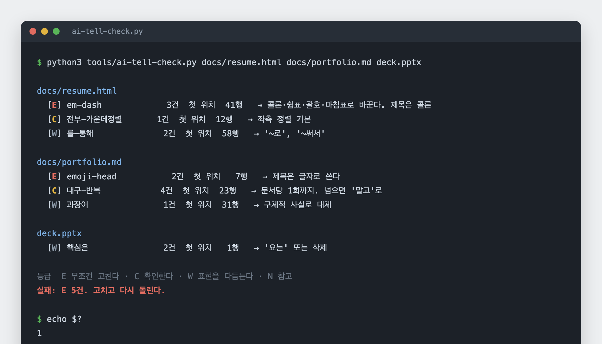

# career-docs

[](https://github.com/kordp888/career-docs-skill/actions/workflows/verify.yml)

취업 서류를 만들고 인쇄 품질 PDF 로 내보내는 Claude Code 스킬입니다.
경력과 숫자를 정본 하나에 묶고, AI 가 쓴 티를 기계로 검사하고, 산출물에서 생성 도구
표식을 지웁니다.

<p align="center">
  
</p>

> **English.** A Claude Code skill for producing job application documents.
> It pins every date and metric to a single source-of-truth file, runs a Korean
> "AI tell" linter over the output, exports print quality PDFs from HTML and PPTX,
> and strips generator metadata before the file leaves your machine.
> Korean-language rules, but the PDF and font tooling is language agnostic.

## 왜 만들었나

공고가 매일 바뀝니다. 같은 직무명이어도 회사마다 요구가 다르고, 어제 본 공고가
오늘 내려가고 새 공고가 올라옵니다. 회사마다 보고 싶어 하는 포트폴리오도 다릅니다.
어떤 곳은 운영 규모를 먼저 묻고, 어떤 곳은 어떻게 검증했는지를 먼저 묻습니다.

그래서 지원할 때마다 같은 일을 손으로 다시 했습니다. 공고를 읽고, 이력서에서
순서를 바꾸고, 포트폴리오에서 어떤 프로젝트를 앞에 둘지 고르고, 조판이 깨진 자리를
고치고, PDF 로 내보내고, 서체가 제대로 박혔는지 확인합니다. 한 곳에 한두 시간씩
들어갑니다. 정작 그 시간에 해야 할 일은 공고를 더 읽고 더 지원하는 것입니다.

숫자는 매일 바뀝니다. 테스트가 늘고, 게시 건수가 올라가고, 차단율이 움직입니다.
서류가 여러 벌이면 어제 고친 숫자가 다른 파일에 옛날 값으로 남습니다. 어느 쪽이
맞는지 확인하는 데 또 시간이 듭니다.

반복되는 자리를 잘라냈습니다. 숫자와 경력은 파일 하나에 두고 서류가 그것만 보게
했습니다. 조판은 두 벌로 고정했습니다. 변환과 검사는 명령 한 줄로 만들었습니다.
회사마다 달라지는 것은 공고를 읽고 순서를 정하는 판단뿐이고, 나머지는 손대지
않습니다.

검사기와 메타데이터 정리는 값을 치르고 배운 자리입니다. 설치 안 된 폰트가 경고 없이
대체돼 제목이 손글씨체로 나간 PDF 를 만든 적이 있고, 작성자 필드에 생성 도구 이름이
남은 파일을 낸 적도 있습니다. 받는 쪽은 파일 정보를 엽니다. 매번 기억해서 막을 일이
아니라서 검사로 고정했습니다.

## 무엇을 하나

| 영역 | 내용 |
|---|---|
| 정본 | 경력·학력·수치를 파일 하나에 묶고 서류는 그것만 따릅니다 |
| 조판 | A4 세로와 16:9 가로 CSS 두 벌. 서류마다 새로 만들지 않습니다 |
| 변환 | HTML 과 PPTX 를 인쇄 품질 PDF 로. 폰트 대체와 가변 폰트 함정 처리 |
| 검사 | 한국어 AI 티 규칙 18종을 정규식으로 검사하고 종료 코드로 알립니다 |
| 정리 | PDF·PPTX 메타데이터에서 생성 도구 표식 제거 |

## 산출물은 두 벌입니다

변환기는 원본을 지우지 않습니다. 고칠 수 있는 파일과 제출할 파일이 항상 짝으로
남습니다.

`html2pdf.sh` 는 HTML 을 A4 PDF 로 바꿉니다. HTML 이 편집본이고 PDF 가 제출본입니다.
글자 하나를 고치려고 PDF 편집기를 열 일이 없습니다. HTML 을 고치고 다시 돌리면
됩니다.

`pptx2pdf.sh` 는 PPTX 를 PDF 로 바꿉니다. PPTX 는 그대로 두므로 파워포인트에서
언제든 고칠 수 있고, PDF 는 상대가 어느 기기에서 열어도 같게 보입니다. 기업에
보낼 때 이 두 벌을 같이 보냅니다. 상대가 내용을 손보고 싶어 하는 경우가 있고,
그때 PDF 만 있으면 다시 만들어 달라는 요청이 돌아옵니다.

서체 치환 인자를 주더라도 사본에서만 바꿉니다. 원본 PPTX 의 서체 선언은 건드리지
않아서, 원래 환경에서 열면 그대로 열립니다.

## 설치

```bash
git clone https://github.com/kordp888/career-docs-skill.git
mkdir -p ~/.claude/skills/career-docs
cp -r career-docs-skill/{SKILL.md,references,tools,styles} ~/.claude/skills/career-docs/
chmod +x ~/.claude/skills/career-docs/tools/*.sh
```

Claude Code 에서 이력서나 포트폴리오 작업을 시작하면 자동으로 걸립니다.
`/career-docs` 로 직접 부를 수도 있습니다.

검사기와 변환기만 쓰려면 `tools/` 의 스크립트를 그대로 실행하면 됩니다.
스킬 설치는 필요 없습니다.

```bash
python3 tools/ai-tell-check.py "docs/**/*.md" out.html deck.pptx

# HTML -> PDF. docs/resume.html 은 그대로 남습니다
./tools/html2pdf.sh docs/resume.html out/resume.pdf

# PPTX -> PDF. deck.pptx 는 그대로 남습니다 (편집본 + 제출본)
./tools/pptx2pdf.sh deck.pptx out "Noto Sans CJK KR=Noto Sans KR"

python3 tools/strip-meta.py out/*.pdf deck.pptx --author "홍길동" --title "이력서"
```

의존성은 얕습니다. 변환은 시스템 Chrome 과 LibreOffice, 검사는 파이썬 표준
라이브러리만 씁니다. 메타데이터 정리에 `pikepdf`, 가변 폰트 처리에 `fonttools` 가
필요하고 둘 다 선택 사항입니다.

## 구성

```
SKILL.md                      절차 (Claude 가 읽습니다)
references/
  facts-template.md           정본 템플릿. 복사해서 채웁니다
  typesetting.md              변환 함정과 대응
tools/
  ai-tell-check.py            AI 티 검사기
  html2pdf.sh                 HTML -> PDF
  pptx2pdf.sh                 PPTX -> PDF (폰트 치환 포함)
  strip-meta.py               생성 도구 표식 제거
  make-static-weights.py      가변 폰트 -> 정적 굵기
styles/
  report.css                  A4 세로 (이력서·포트폴리오)
  deck.css                    16:9 가로 (과제·제안서)
examples/
  resume.html                 최소 골격
```

## 검사기

`ai-tell-check.py` 는 파일을 읽어 규칙에 걸리는 자리를 찾고, E 등급이 하나라도 있으면
종료 코드 1 을 냅니다. 커밋 훅이나 CI 에 그대로 걸 수 있습니다.

```
$ python3 tools/ai-tell-check.py docs/resume.html

docs/resume.html
  [E] em-dash            3건  첫 위치 41행   → 콜론·쉼표·괄호·마침표로 바꾼다
  [C] 전부-가운데정렬      1건  첫 위치 12행   → 좌측 정렬 기본
  [W] 를-통해             2건  첫 위치 58행   → '~로', '~써서'

등급  E 무조건 고친다 · C 확인한다 · W 표현을 다듬는다 · N 참고
실패: E 3건. 고치고 다시 돌린다.
```

`md` `txt` `html` `css` `js` `json` `yaml` 은 원문을, `pptx` `docx` `xlsx` 는 내부
XML 을 읽습니다. 마크다운의 코드 블록과 인라인 코드는 검사하지 않습니다. 규칙 문서가
금지어를 나열하는 것까지 위반으로 잡히면 검사기를 못 쓰기 때문입니다. 파일 첫 20 줄에
`ai-tell-check: skip` 을 두면 그 파일 전체를 건너뜁니다.

규칙은 세 묶음입니다. 글 규칙은 줄표와 이모지 제목처럼 눈에 띄는 것부터 `~를 통해`,
`핵심은`, `결론적으로` 같은 상투어까지 봅니다. 디자인 규칙은 CSS 와 HTML 에만 적용되고
지금 생성 도구가 자주 뱉는 조합을 잡습니다. 문체 규칙은 존댓말 여부를 참고로 알리되
코드와 테스트 디렉터리는 면제합니다.

규칙을 고치는 자리는 파일 위쪽의 `RULES` 와 `DESIGN` 리스트 하나뿐입니다.
`(이름, 정규식, 등급, 고치는 법)` 네 칸을 추가하면 끝입니다.

## 이 스킬이 하지 않는 것

**대신 지원하지 않습니다.** 제출 직전 단계까지만 준비합니다. 버튼은 본인이 누릅니다.

**숫자를 만들어 주지 않습니다.** 정본에 없는 수치는 서류에 들어가지 않습니다.
못 센 것은 못 셌다고 쓰게 합니다. 이 항목이 비어 있는 정본은 대체로 덜 정직합니다.

**문장을 대신 써 주는 도구도 아닙니다.** 검사기는 이미 쓴 글에서 반복 패턴을 찾을 뿐,
내용의 좋고 나쁨은 판단하지 않습니다.

**영어 글은 규칙 일부만 걸립니다.** 마케팅 상투어 열 몇 개를 보고 나머지는 한국어
기준입니다. 변환과 폰트 쪽 도구는 언어와 무관하게 씁니다.

## 푸시마다 자동으로 확인하는 것

| 단계 | 확인 | 실패하면 |
|---|---|---|
| 1 도구 | 검사기가 위반을 잡고 종료 코드 1 을 내는가, HTML→PDF 가 실제로 나오는가, 메타데이터가 지워지는가 | 도구가 말로만 도는 것 |
| 2 자기검사 | README·SKILL·참고 문서를 자기 검사기로 검사 | 검사기를 만든 저장소가 검사에 걸린 것 |
| 3 비밀 | 토큰·전화번호 패턴 | 예제에 실제 연락처가 들어간 것 |

## 라이선스

Apache License 2.0. 규칙 목록과 CSS 를 각자 상황에 맞게 고쳐 쓰십시오.
회사 안에서 쓰기 쉽도록 특허 실시권과 기여 조건이 명시된 쪽을 골랐습니다.
재배포할 때는 `NOTICE` 를 같이 두고, 고친 파일에는 고쳤다는 표시를 남깁니다.
